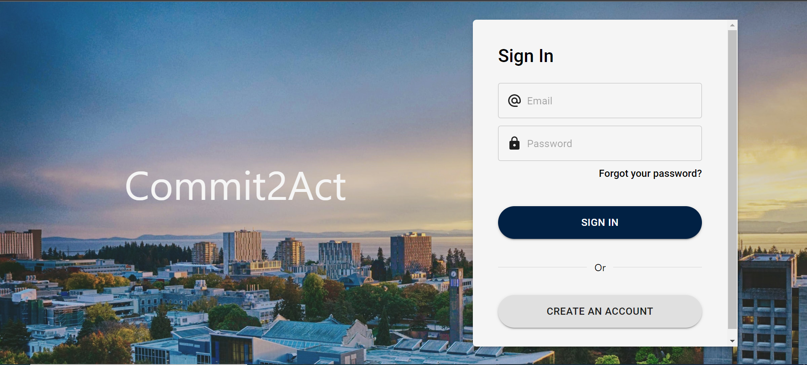
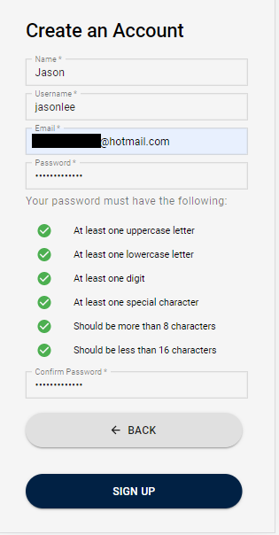
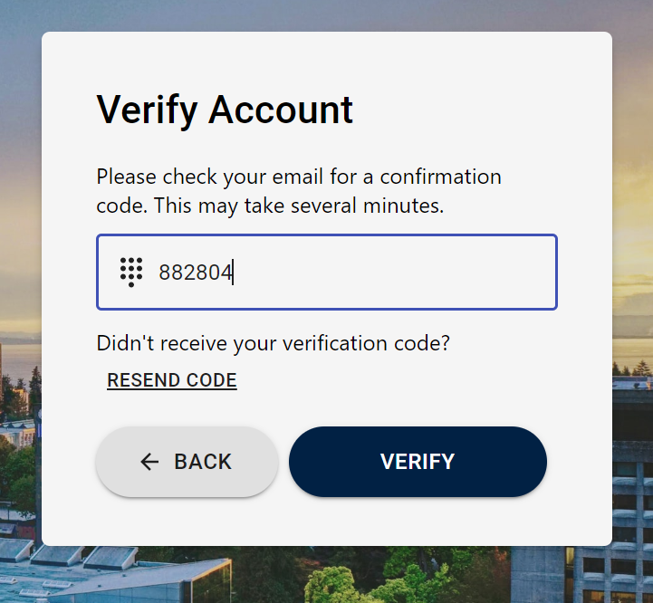
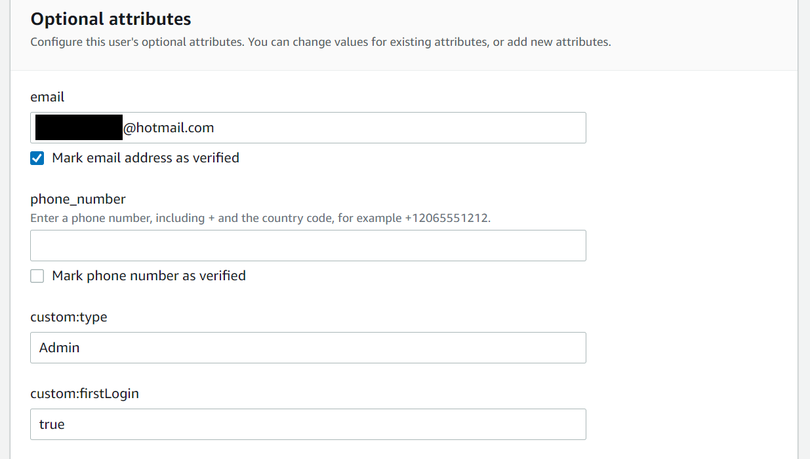

# Requirements

Before you deploy, you must have the following installed on your device:

- [AWS Account](https://aws.amazon.com/account/)
- [GitHub Account](https://github.com/)
- [AWS CLI](https://aws.amazon.com/cli/)
- [AWS SAM](https://docs.aws.amazon.com/serverless-application-model/latest/developerguide/serverless-sam-cli-install.html)

# Step 1: Clone The Repository

First, clone the GitHub repository onto your machine. To do this:

1. Create a folder on your computer to contain the project code.
2. For an Apple computer, open Terminal. If on a Windows machine, open Command Prompt. Enter into the folder you made using the command `cd path/to/folder`. To find the path to a folder on a Mac, right click on the folder and press `Get Info`, then select the whole text found under `Where:` and copy with ⌘C. On Windows, enter into the folder on File Explorer and click on the path box (located to the left of the search bar), then copy the whole text that shows up.
3. Clone the github repository by entering the following:

```bash
git clone https://github.com/UBC-CIC/commit2act.git
```

The code should now be in the folder you created. Navigate into the frontend folder containing the Amplify project by running the commands:

```bash
cd commit2act
```

# Step 2: Frontend Deployment

Before installing Amplify we need to create the IAM Role that gives us the permissions needed to implement this solution.

```bash
aws cloudformation deploy --template-file cfn-amplifyRole.yaml --stack-name amplifyconsole-commit2act-backend-role --capabilities CAPABILITY_NAMED_IAM
```

If you have multiple AWS Profiles, specify one with sufficient admin permissions by adding this to the end of the command, replacing the profile name with the profile you would like to use for the solution

```bash
--profile [PROFILE NAME]
```

The previous command creates the role name **amplifyconsole-commit2act-backend-role** that will be used on the next step.

The **Deploy to Amplify Console** button will take you to your AWS console to deploy the front-end solution.

<a href="https://console.aws.amazon.com/amplify/home#/deploy?repo=https://github.com/UBC-CIC/commit2act/tree/main/frontend">
    
</a>

1. On the AWS console. select your region on the top right, then connect to github
2. Select the **amplifyconsole-commit2act-backend-role** for deployment
3. The deployment will take a few minutes. Wait until the status shows **Verify** in green
4. Click on left taskbar to open menu, click on Rewrites and redirects, and click on edit
5. Click and replace the first rule's source address (or add a rule if there is none) to `</^((?!\.(css|gif|ico|jpg|js|png|txt|svg|woff|ttf)$).)*$/>`, click and replace target address to `/index.html`, and select and replace **type** with `200 (Rewrite)`, then save. Add a second rule, with the source address as `</^((?!\.(css|gif|ico|jpg|js|png|txt|svg|woff|ttf)$).)*$/>`, the target address as `/index.html`, and the **type** with `404 (Rewrite)`.
   Refer to [AWS's Page on Single Page Apps](https://docs.aws.amazon.com/amplify/latest/userguide/redirects.html#redirects-for-single-page-web-apps-spa) for further information on why we did that
   
6. Proceed to backend deployment (link here) before continuing with the following steps
7. At the [AWS online console](https://console.aws.amazon.com/console/home), enter **Cloudfront** in the search bar. Click on the Distributions tab, and click the ID of the distribution with the origin \_\_\_\_. Under the General tab of that distribution, copy the Distribution Domain Name under the Details heading.

//add image

8. Navigate back to the amplify console by entering **Amplify** at the [AWS online console](https://console.aws.amazon.com/console/home). Under the App Settings heading on the left hand sidebar, click Environment Variables. Add an environment variable with the Variable field as `REACT_APP_CLOUDFRONT_DOMAIN_NAME`, and the Value as the Distribution Domain Name that was copied in the previous step.

// add image

Congratulations, your web app is now deployed!

# Step 3: Backend Deployment

Now that we have set up the frontend of our application, it's time to set up everything that goes on behind the scenes! For more information on how the backend works, feel free to refer to the Architecture Deep Dive, but an understanding of how it all works is not necessary for deployment.

The first step is to get into the backend folder. This can be done with the following commands:

```bash
cd ..
cd backend
```

# Step 4: Register Admin Account

Here, you'll learn how to register for an account on the web app, then how to set any accounts to Commit2Act Admin.

1. At the login page for the Commit2Act website, click create an account \
   
2. Enter Account Details and click Sign-up. **Verification code is sent to email.** \
   
3. User retrieves verification code from email and enters it to Verify Account\
   
4. At the [AWS online console](https://console.aws.amazon.com/console/home), enter **Cognito** in the search bar \
   
5. Select the user pool corresponding to the project name (Default commit2act-deve) \
   
6. Select the user which you want to set to Admin \
   
7. Scroll down to User Attributes, and click **Edit** \
   
8. Scroll down to Option Attributes, and change the value in the **custom:type** field from _User_ to _Admin_. Click **Save Changes**\
   
9. You have set up login credentials. Return to Commit2Act web app, and login. Your user is now a Commit2Act Admin! (If you are having issues, try relogging on the Commit2Act web app)\

# Troubleshooting

### Error #1

If you encounter the following error:

```bash
The config profile could not be found
```

chances are that the AWS CLI has not been correctly configured. Ensure you have correctly done so by following the [AWS CLI setup guide](https://aws.amazon.com/cli/), as indicated in the requirements section.
